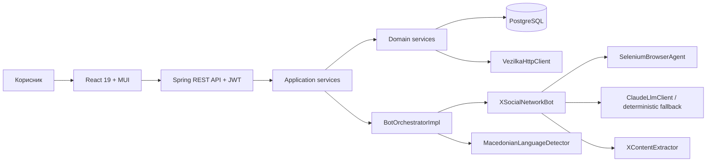

# Vezilka / X — целосна техничка документација

## 1. Цел на проектот

Проектот е Spring Boot и React апликација која со реален browser го отвора X,
пребарува јавно достапна содржина, извлекува објави и медиуми, проценува колкав
дел од текстот е на македонски јазик и овозможува избраната содржина да се
подготви за донирање во `doniraj.vezilka.ai`.

Главните принципи се:

- се обработува само јавно достапна содржина;
- секоја објава го задржува оригиналниот X URL;
- не се создаваат измислени demo објави;
- bot workflow-от е read-only: не објавува, не лајкува, не следи и не праќа пораки;
- тајните се читаат од environment variables и не се чуваат во кодот.

## 2. Што е задржано од зададениот template

Задржани се слоевите, пакетите и договорите од факултетскиот template:

```text
web/controller
    ↓ DTO
service/application
    ↓ entity
service/domain
    ↓
repository
```

Bot слоевите не пристапуваат директно до repository. Перзистирањето го
координира `BotOrchestratorImpl` преку service интерфејсите.

Не се реимплементирани:

- JWT authentication flow;
- обезбедениот agentic loop во `AbstractSocialNetworkBot`;
- `BotActionLogService`;
- оригиналните Flyway миграции `V1`–`V5`;
- shared интерфејсите `BrowserAgent`, `LlmClient`, `ContentExtractor`,
  `LanguageDetector`, `SocialNetworkBot` и `VezilkaClient`;
- frontend JWT flow и `sessionsProvider`.

Сите нови database полиња се додадени во нова миграција
`V6__add_extraction_session_options.sql`, без менување на `V1`–`V5`.

## 3. Архитектура



### Backend технологии

- Java 21
- Spring Boot 3.4
- Spring Security и JWT
- Spring Data JPA
- PostgreSQL 17
- Flyway
- Selenium
- Maven
- JUnit, Mockito и Spring integration tests

### Frontend технологии

- React 19
- TypeScript
- Vite
- Material UI
- Axios
- React Router
- Vitest, Testing Library и jsdom

## 4. Реализирани milestone-и

### 4.1 Browser agent

`SeleniumBrowserAgent` е реална имплементација на `BrowserAgent`.

Одговорности:

- отвора Chrome;
- користи persistent browser profile кога е конфигуриран;
- навигира до X URL;
- чека динамичка содржина;
- скролува за дополнителни резултати;
- враќа `PageSnapshot`;
- извлекува HTML од видливата страница;
- го затвора browser ресурсот контролирано.

`BOT_PROFILE_DIRECTORY` овозможува рачното X најавување да се зачува за
следните сесии. Автоматски username/password login е исклучен по default затоа
што X често го ограничува automated Chrome login.

### 4.2 LLM decision-making

`ClaudeLlmClient` го имплементира `LlmClient` договорот.

Има два режима:

1. `ANTHROPIC_ENABLED=true` — праќа goal и page snapshot кон Claude и парсира
   структуриран `BotDecision`;
2. `ANTHROPIC_ENABLED=false` — користи детерминистички read-only план:
   `NAVIGATE → WAIT → EXTRACT → SCROLL → ... → FINISH`.

Ако Claude е недостапен или нема credits, workflow-от продолжува со fallback.
Затоа live extraction може да работи и без Claude API key.

### 4.3 X social-network bot

`XSocialNetworkBot` го проширува `AbstractSocialNetworkBot` и го задржува
обезбедениот perceive-decide-act loop.

Поддржани target типови:

| Тип | Влез | Однесување |
|---|---|---|
| `KEYWORD` | `Скопје` | X live search за зборот |
| `HASHTAG` | `Македонија` или `#Македонија` | X live search за hashtag |
| `PROFILE` | `@username` | отвора јавен X профил |
| `FEED_URL` | валиден X URL | директна навигација |

За keyword и hashtag frontend формата прифаќа повеќе вредности разделени со
запирка. Дупликатите се отстрануваат case-insensitive пред испраќање.

### 4.4 Extraction и македонски јазик

`XContentExtractor` ги парсира видливите
`article[data-testid='tweet']` елементи.

За секоја објава се извлекуваат:

- X external ID;
- автор;
- текст;
- оригинален source URL;
- време на објавување кога е достапно;
- слики;
- video metadata;
- social network (`X`).

`MacedonianLanguageDetector` пресметува confidence score во интервал `0.0–1.0`.
Самата кирилица не се смета за доволен доказ. Detector-от комбинира:

- процент на кирилични букви;
- карактеристични македонски букви (`ѓ`, `ќ`, `ѕ`, `ј`, `љ`, `њ`, `џ`);
- македонски функционални и чести зборови;
- негативни букви што не припаѓаат во македонската азбука;
- негативни руски, бугарски и српски лексички сигнали.

На тој начин руска објава што случајно содржи „финки“ не поминува како
македонска. За ова постои посебен regression тест со реалниот проблематичен
пример. Не се користи X `lang:mk`, бидејќи тој оператор не дава сигурни
резултати.

#### Забележан и поправен проблем со точноста

Во текот на live тестирањето беше забележан false-positive резултат: руска
објава што го содржеше зборот „финки“ беше означена како македонска. Причината
беше што првата верзија на алгоритмот доделуваше `55%` од score-от само врз
основа на тоа што текстот е напишан на кирилица. Руски, српски и бугарски
текстови поради заедничкото писмо и кратките заеднички зборови можеа погрешно
да го надминат прагот од `50%`.

Detector-от потоа беше заострен:

- тежината на самото кирилично писмо е намалена;
- македонските карактеристични букви и зборови добиваат поголема тежина;
- `ј/љ/њ/џ`, кои постојат и во српскиот, се третираат само како слаб помошен
  сигнал, додека `ѓ/ќ/ѕ` се силни македонски сигнали;
- буквите што не се дел од македонската азбука создаваат силна казна;
- додадени се негативни руски, српски и бугарски зборови;
- повеќе странски сигнали го ограничуваат score-от под прифатливиот праг;
- додадени се regression тестови за рускиот реален пример, бугарски текст и
  кириличен текст без македонски докази.

По поправката конкретната руска објава добива score под `20%` и при стандардниот
праг од `50%` не се зачувува во нова extraction сесија. Ова е намерно
конзервативен пристап: подобро е сомнителен странски текст да се исклучи отколку
да се донира како македонски корпус.

За постарите записи е додаден `PostLanguageReclassification`. При секое
стартување на backend-от тој повторно го пресметува score-от на сите објави што
сè уште не се ставени во donation batch. Донираните записи намерно не се
менуваат за да не се наруши историјата на donation workflow-от. Posts екранот
стандардно се отвора со праг `50%`, па старите руски/српски/бугарски записи по
reclassification повеќе не се прикажуваат во нормалниот преглед.

### 4.5 Оркестрација

`BotOrchestratorImpl`:

- ја менува сесијата од `CREATED` во `RUNNING`;
- ги обработува target-ите еден по еден;
- ја почитува глобалната квота `maxPosts`;
- ги филтрира избраните типови содржина;
- пресметува language confidence;
- отстранува дупликати по source URL, external ID или author/content fallback;
- ги зачувува објавите и медиумите;
- зачувува trace записи;
- ја завршува сесијата како `COMPLETED` или `FAILED`.

`SessionStartedEvent` и `SessionStartedListener` овозможуваат browser extraction
да се извршува асинхроно, без HTTP request-от да чека до крај.

`StaleRunningSessionRecovery` при стартување означува прекинати стари
`RUNNING` сесии како `FAILED`.

### 4.6 Domain и application services

Имплементирани се:

- extraction session CRUD и state transitions;
- paged и filtered posts;
- post details и delete;
- donation batch lifecycle;
- DTO ↔ entity мапирање;
- контролирани domain exceptions.

Application services комуницираат со controller-ите преку DTO records, а domain
services работат со entities и repositories.

### 4.7 Vezilka интеграција

`VezilkaHttpClient`:

- формира text donation request;
- праќа donation batch до конфигуриран endpoint;
- го чува надворешниот reference;
- го проверува статусот на веќе испратени batches;
- ја претвора надворешната грешка во `VezilkaIntegrationException`.

Donation lifecycle:

```text
DRAFT → APPROVED → SUBMITTED → ACCEPTED
                              ↘ REJECTED
```

Реален submit бара валиден `VEZILKA_API_KEY` и точен API contract. Без key може
безбедно да се демонстрираат create и approve чекорите.

### 4.8 Frontend

Имплементирани се:

- login и register преку обезбедениот JWT flow;
- responsive header и navigation;
- почетен dashboard со системски бројачи;
- форма за сесија со повеќе targets;
- избор на максимум објави;
- избор на минимален македонски праг;
- избор на текст, слики и видео;
- листа и детали на сесии;
- live bot trace со локализирани чекори;
- статистика за сесија;
- posts grid, pagination и filters;
- филтер по текст/автор, session ID, donation status и language threshold;
- детали за објава и приказ на слика/видео;
- отворање на оригиналниот X URL;
- donation workflow;
- JSON и CSV export;
- loading, empty, error и retry состојби;
- route-level lazy loading.

Lazy loading го намали главниот production bundle од приближно `656 KB` на
`309 KB`; страниците се вчитуваат како посебни chunks.

### 4.9 Тестови

Backend тестовите опфаќаат:

- application context;
- repositories;
- request DTO validation;
- session service transitions;
- donation service integration;
- Macedonian language detector;
- Claude response/fallback однесување.

Frontend тестовите опфаќаат:

- претворање на comma-separated зборови во повеќе targets;
- case-insensitive отстранување дупликати;
- зачувување на extraction options;
- post text filter;
- Session ID filter и number conversion.

## 5. Database модел и миграции

### Главни табели

- `users`
- `extraction_sessions`
- `extraction_targets`
- `extracted_posts`
- `media_items`
- `donation_batches`
- `donation_batch_posts`
- `bot_action_logs`

### Flyway

| Миграција | Намена |
|---|---|
| `V1` | корисници |
| `V2` | extraction sessions и targets |
| `V3` | posts и media |
| `V4` | donations |
| `V5` | bot action logs |
| `V6` | max posts, language threshold и content options |

`V6` додава:

- `max_posts` со дозволен интервал `1–100`;
- `min_macedonian_confidence` со интервал `0.0–1.0`;
- `include_text`;
- `include_images`;
- `include_videos`.

## 6. REST API

### Корисници

| Method | Endpoint | Опис |
|---|---|---|
| `POST` | `/api/user/register` | регистрација |
| `POST` | `/api/user/login` | JWT login |
| `GET` | `/api/user/me` | тековен корисник |

### Сесии

| Method | Endpoint | Опис |
|---|---|---|
| `GET` | `/api/sessions` | листа |
| `GET` | `/api/sessions/{id}` | детали |
| `POST` | `/api/sessions/add` | креирање |
| `POST` | `/api/sessions/{id}/start` | старт |
| `POST` | `/api/sessions/{id}/stop` | стоп |
| `GET` | `/api/sessions/{id}/logs` | live trace |

### Објави и analytics

| Method | Endpoint | Опис |
|---|---|---|
| `GET` | `/api/posts` | paged и filtered posts |
| `GET` | `/api/posts/{id}` | детали |
| `DELETE` | `/api/posts/{id}/delete` | бришење |
| `GET` | `/api/posts/session/{sessionId}/statistics` | статистика |
| `GET` | `/api/posts/export/json` | JSON export |
| `GET` | `/api/posts/export/csv` | UTF-8 CSV export |

### Донации

| Method | Endpoint | Опис |
|---|---|---|
| `GET` | `/api/donations` | листа |
| `GET` | `/api/donations/{id}` | детали |
| `POST` | `/api/donations/add` | draft batch |
| `POST` | `/api/donations/{id}/approve` | approve |
| `POST` | `/api/donations/{id}/submit` | Vezilka submit |

Интерактивна API документација:
`http://localhost:8080/swagger-ui/index.html`.

## 7. Конфигурација

Во `ai-bot-backend`:

```powershell
Copy-Item .env.example .env
```

Клучни променливи:

| Променлива | Опис |
|---|---|
| `JWT_SECRET_KEY` | signing secret |
| `X_EXTRACTION_MODE` | `LIVE_BROWSER`, `API` или `AUTO` |
| `X_BROWSER_AUTO_LOGIN` | автоматски login; препорачано `false` |
| `BOT_HEADLESS` | видлив/невидлив browser |
| `BOT_PROFILE_DIRECTORY` | persistent Chrome profile |
| `X_MAX_POSTS` | default extraction лимит |
| `ANTHROPIC_ENABLED` | Claude on/off |
| `ANTHROPIC_API_KEY` | опционален Claude key |
| `VEZILKA_API_KEY` | Vezilka key |

`.env`, X профилот и API keys не смеат да се commit-ираат или да влезат во ZIP.

## 8. Стартување

### Backend

```powershell
cd ai-bot-backend
docker compose up -d

$env:JAVA_HOME = "C:\path\to\jdk-21"
$env:Path = "$env:JAVA_HOME\bin;$env:Path"

.\mvnw.cmd spring-boot:run
```

### Frontend

Во нов терминал:

```powershell
cd ai-bot-frontend
npm.cmd install
npm.cmd run dev -- --port 3001
```

Адреси:

- frontend: `http://localhost:3001`
- backend: `http://localhost:8080`
- Swagger: `http://localhost:8080/swagger-ui/index.html`
- PostgreSQL host port: `5433`

## 9. Како се користи

1. Регистрирај корисник и најави се.
2. Отвори **Сесии**.
3. Креирај сесија.
4. Избери target тип.
5. За повеќе keywords внеси, на пример:
   `Скопје, Македонија, Кавадарци`.
6. Постави maximum, language threshold и content types.
7. Стартувај ја сесијата.
8. Ако X побара login, најави се рачно во browser прозорецот.
9. Следи го live trace.
10. По `COMPLETED`, отвори **Објави** и филтрирај по Session ID.
11. Отвори детали и провери го оригиналниот X URL.
12. Креирај donation draft од избраните објави.
13. Approve, а submit користи само со валиден Vezilka key.

## 10. JSON и CSV export

Export-от не значи дека постои нова X содржина. Тој ги извезува реалните
објави што веќе се зачувани во PostgreSQL.

JSON е погоден за:

- API интеграција;
- зачувување на целосната структура;
- media metadata;
- машинска обработка.

CSV е погоден за:

- Excel;
- табеларна проверка;
- анализа и предавање dataset.

CSV response-от содржи UTF-8 BOM за правилно прикажување на македонски знаци во
Excel.

## 11. Безбедност и responsible use

- JWT ги штити application endpoints.
- Password-ите се hash-ираат.
- CORS е ограничен на локалните frontend порти.
- Secrets се environment variables.
- Bot-от е read-only.
- Се чува provenance преку оригинален source URL.
- Не се извлекуваат private messages или приватни профили.
- Ограничувањето на чекори и WAIT акцијата го намалуваат агресивното scraping.

## 12. Надворешни ограничувања

Ова не се дефекти во кодот:

- X може привремено да ограничи automated login.
- X може да го промени DOM и CSS selector-ите.
- Резултатите зависат од X search и од најавениот профил.
- Claude бара credits само ако е активиран.
- Vezilka submit бара валиден key и достапен endpoint.
- „Сите објави што некогаш постоеле“ не може да се гарантираат преку бесконечно
  скролување; се почитуваат лимити и rate limits.

## 13. Резиме на новите фајлови и промени

Најважни специфични имплементации:

- `SeleniumBrowserAgent`
- `ClaudeLlmClient`
- `XSocialNetworkBot`
- `XContentExtractor`
- `MacedonianLanguageDetector`
- `BotOrchestratorImpl`
- `VezilkaHttpClient`
- `XApiClient`
- `ExtractionAnalyticsController`
- `SessionStatisticsDto`
- `StaleRunningSessionRecovery`
- `V6__add_extraction_session_options.sql`

Frontend дополнувања:

- session, posts и donations hooks;
- session form и trace viewer;
- post filters, grid и details;
- donation components;
- статистика и export;
- responsive custom design;
- lazy-loaded routes;
- Vitest test setup и component tests.

