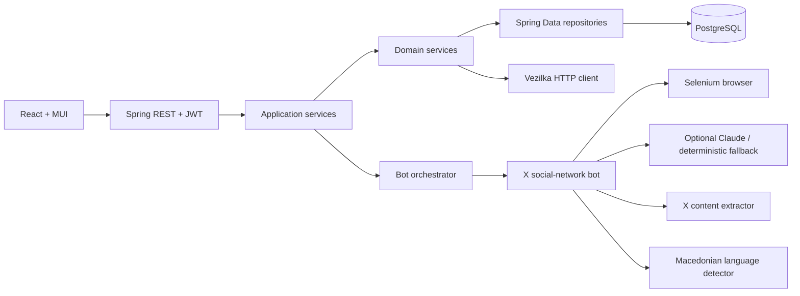

# AI Bot интеграција со X


Spring Boot и React апликација за пронаоѓање реална македонска содржина на X,
извлекување текст и медиуми, јазична проценка и подготовка на проверливи
донации за `doniraj.vezilka.ai`.

## Главни можности

- live пребарување на X по клучен збор, hashtag, профил или URL;
- повеќе цели во една extraction сесија;
- извлекување автор, текст, датум, оригинален URL, слики и видеа;
- дедупликација во рамки на целата сесија;
- confidence score за македонски јазик;
- реални бројачи од X (одговори, репостови, лајкови, прегледи) и страница
  **Најдобри објави** со рангирање по ангажман;
- Stop што навистина го запира ботот и сесија што може да продолжи без дупликати;
- live trace со чекори, успешност и статистика по target;
- JWT регистрација и најава;
- филтрирање, pagination и детален преглед на објави;
- donation workflow: `DRAFT → APPROVED → SUBMITTED → ACCEPTED/REJECTED`;
- опционална Claude интеграција и deterministic read-only fallback;
- PostgreSQL, Flyway и автоматизирани backend тестови.

Системот не создава фиктивни X објави. Во `LIVE_BROWSER` режим се зачувува само
содржина што навистина е прочитана од јавниот X интерфејс.

## Архитектура



Зададената template структура е зачувана:

```text
web → service.application → service.domain → repository
```

Не се изменети споделените интерфејси (`BrowserAgent`, `LlmClient`,
`ContentExtractor`, `LanguageDetector`, `SocialNetworkBot`, `VezilkaClient`)
ниту final agent loop-от во `AbstractSocialNetworkBot`.

## Предуслови

- Java 21
- Docker Desktop
- Node.js и npm

## Стартување на Windows

### 1. База и backend

```powershell
cd ".\ai-bot-backend"

docker compose up -d

$env:JAVA_HOME = "C:\path\to\jdk-21"
$env:Path = "$env:JAVA_HOME\bin;$env:Path"

.\mvnw.cmd spring-boot:run
```

### 2. Frontend

Во нов PowerShell:

```powershell
cd ".\ai-bot-frontend"

npm.cmd install
npm.cmd run dev -- --port 3001
```

- Апликација: `http://localhost:3001`
- Swagger: `http://localhost:8080/swagger-ui/index.html`

## Конфигурација

Локалните вредности се во `ai-bot-backend/.env`. Оваа датотека не смее да се
commit-ира.

```dotenv
JWT_SECRET_KEY=replace-with-a-long-random-secret

X_EXTRACTION_MODE=LIVE_BROWSER
X_BROWSER_AUTO_LOGIN=false
X_USERNAME=
X_PASSWORD=
BOT_HEADLESS=false
BOT_PROFILE_DIRECTORY=C:/Users/Marija/.aibot-x-chrome-profile
X_MAX_POSTS=15

ANTHROPIC_ENABLED=false
ANTHROPIC_API_KEY=
ANTHROPIC_MODEL=claude-sonnet-4-6

VEZILKA_API_KEY=
```

### Claude

Claude е опционален. Со:

```dotenv
ANTHROPIC_ENABLED=false
ANTHROPIC_API_KEY=
```

ботот користи безбеден deterministic workflow: navigate, wait, extract,
scroll и finish. Не се прават Anthropic API повици и не се трошат credits.

За Claude decision-making:

```dotenv
ANTHROPIC_ENABLED=true
ANTHROPIC_API_KEY=your-key
```

Ако Claude привремено откаже, сесијата автоматски продолжува со fallback.

### X најавување

Автоматско username/password најавување е исклучено по default бидејќи X може
да го ограничи automated Chrome. Препорачано е:

1. `X_BROWSER_AUTO_LOGIN=false`;
2. стартувај live сесија;
3. ако X бара најава, најави се рачно во отворениот browser profile;
4. следните сесии го користат истиот `BOT_PROFILE_DIRECTORY`.

## Extraction workflow

1. Корисникот креира сесија со една или повеќе цели.
2. Backend-от ја менува состојбата `CREATED → RUNNING`.
3. Async listener го стартува orchestrator-от.
4. За секој target се извршува непроменетиот perceive-decide-act loop.
5. Се извлекуваат само видливи јавни X објави.
6. Се пресметува македонски confidence.
7. Дупликатите се отстрануваат преку URL/external ID.
8. Се зачувуваат уникатните објави и trace статистиката.
9. Сесијата станува `COMPLETED` или `FAILED`.

Ако backend-от се прекине, старите `RUNNING` сесии при следното стартување
автоматски се означуваат како `FAILED`.

## Проверка

Backend:

```powershell
cd ai-bot-backend
$env:JAVA_HOME = "C:\path\to\jdk-21"
$env:Path = "$env:JAVA_HOME\bin;$env:Path"
.\mvnw.cmd test
```

Frontend:

```powershell
cd ai-bot-frontend
npm.cmd test
npm.cmd run build
npm.cmd run lint
```

## Сценарио за презентација

1. Најави се во апликацијата.
2. Отвори **Сесии → Нова сесија**.
3. Избери `KEYWORD` и внеси `Скопје`.
4. Додади втор target, на пример `HASHTAG: Македонија`.
5. Стартувај ја сесијата и отвори го live trace-от.
6. Покажи ги extraction чекорите и финалната статистика.
7. Во **Објави** демонстрирај филтер, македонски процент, медиуми и бројачите од X.
8. Отвори **Најдобри** и смени го рангирањето (ангажман, лајкови, репостови).
9. Отвори оригинален X URL за да покажеш дека објавата е реална.
10. Во **Донации** креирај draft и одобри го.
11. Submit демонстрирај само ако е обезбеден валиден Vezilka API key.

## Познати надворешни ограничувања

- X може привремено да ограничи automated browser најавување.
- Промена на X DOM може да бара адаптација на CSS selector-ите.
- Vezilka submit бара валиден API key и активен API contract.
- Claude бара credits само кога `ANTHROPIC_ENABLED=true`.

Овие состојби се прикажуваат како контролирани грешки и не создаваат лажни
успешни резултати.
